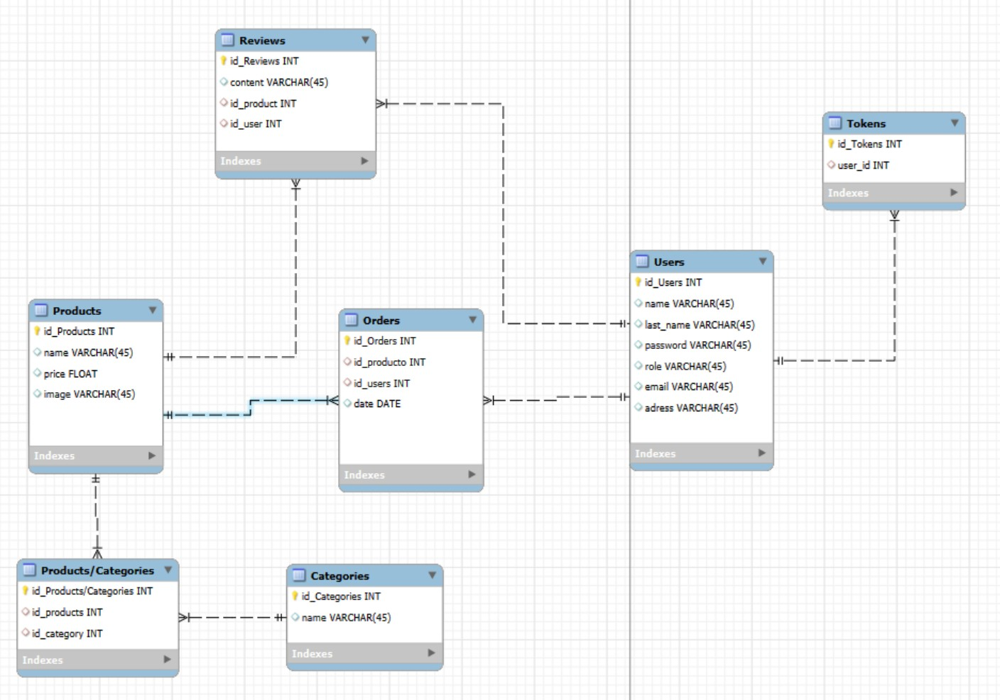

# La DUCK Web

### API REST de Tienda Online 🐥🛒

**La DUCK Web**, es un proyecto de backend para una tienda online de patitos de goma pintados a mano, inspirado en personajes icónicos como **Arnold Cuakzenegger** o **Dua Cuak**. Este e-commerce ha sido desarrollado con Node.js, Express y Sequelize (MySQL).

## 🔧 Tecnologías usadas

- **Node.js**
- **Express**
- **Nodemon**
- **MySQL**
- **Sequelize**
- **JWT (JSON Web Tokens)**
- **Bcrypt**
- **Multer**

## 📌 Funcionalidades principales

#### 🔐 Autenticación y Autorización

- Registro de usuarios con **bcrypt**
- Login con **bcrypt + JWT**
- Middleware de autenticación para rutas protegidas
- Middleware de autorización para control de acceso por rol (admin/mamaPato)

#### 📦 Productos

- CRUD completo con validación de campos
- Filtro por nombre (`/products/name/:name`)
- Filtro por precio exacto o por rango (`/products/price/:minprice/:maxprice`)
- Orden descendente por precio (`/products/price`)
- Relación many-to-many con categorías
- Subida de imágenes con **Multer**
- Solo usuarios autenticados pueden crear, editar o borrar productos
- Solo admins pueden realizar acciones de escritura

#### 🗂️ Categorías

- CRUD completo
- Filtro por nombre (`/categories/name/:name`)
- Relación many-to-many con productos
- Ver categorías con sus productos relacionados (`/categories`)

#### 🛒 Pedidos

- Crear pedidos (relación many-to-many con productos)
- Ver todos los pedidos con los productos que contiene
- Ver pedidos por usuario logueado

#### 🧑 Usuarios

- Registro
- Login
- Logout
- Información del usuario autenticado con sus pedidos
- Validaciones en el registro y login

#### 🌟 Reviews

- CRUD completo de reviews
- Relación one-to-many con usuarios y productos
- Ver todas las reviews junto al usuario que la escribió
- Ver reviews al traer productos (junto a sus categorías)

## 🔗 Relaciones entre modelos

- **Usuarios - Pedidos**: One to Many
- **Usuarios - Tokens**: One to Many
- **Usuarios - Reviews**: One to Many
- **Productos - Categorías**: Many to Many
- **Productos - Reviews**: One to Many
- **Productos - Pedidos**: One to Many
- **Productos - Reviews**: One to Many

> Diagrama de relaciones  
> 

## 🌱 Seeders

Para:

- products
- category
- prod_cat
- user
- review

## 🔐 Roles y Seguridad

- Los roles están gestionados a través de un campo `role` en el modelo `User`
- Middleware `isAdmin` para proteger rutas sensibles
- Middleware `authentication` para proteger endpoints que requieren sesión activa

## 🖼️ Subida de imágenes

Implementación con **Multer** para adjuntar imágenes al crear/actualizar productos. Las imágenes se almacenan en una carpeta `/uploads` con nombre único.

## 📁 Estructura del proyecto

📁 LADUCKWEB/  
├── 📁 config/  
├── 📁 controllers/  
├── 📁 middlwares/  
├── 📁 migrations/  
├── 📁 models/  
├── 📁 node_modules/  
├── 📁 routes/  
├── 📁 seeders/  
├── .gitignore  
├── index.js  
├── package-lock.json  
├── package.json  
└── README.md

## ▶️ Ejecutar localmente

#### 1. Clona el proyecto y sigue los pasos para ejecutarlo en tu entorno local:

```bash
git clone https://github.com/alejandrogoscu/LaDuckWeb
```

#### 2. Accede a la carpeta del proyecto

```bash
cd la-duck-web
```

#### 3. Instala las dependencias

```bash
npm install
```

#### 4. Cofingura la base de datos

- Edita el archivo config/config.example.js con tus credenciales.
- Ejecuta las migraciones:

```bash
sequelize db:migrate
```

- Puebla las tablas con los seeders:

```bash
sequelize db:seed:all
```

#### 5.Inicia el servidor

```bash
npm run dev
```

El servidor arranca en http://localhost:3000

## Documentación API 🧲

La documentación de la API del proyecto se encuentra detallada en el siguiente link:
https://documenter.getpostman.com/view/45418601/2sB2qgdy5a

## 💻 Autores

Proyecto desarrollado por [Paloma Kanala](https://github.com/palomaceg) y [Alex Goscu](https://github.com/alejandrogoscu) como parte del bootcamp de desarrollo web FullStack en [The Bridge](https://thebridge.tech/).
